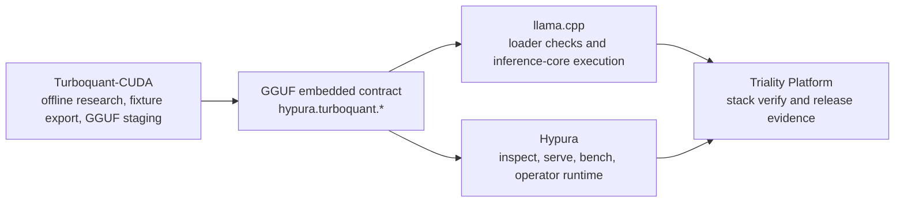

# Triality Platform

**Turn TurboQuant and Triality research into a runnable, verifiable GGUF stack.**

Triality Platform is the parent integration repo for three moving parts that
usually drift apart:

- `Turboquant-CUDA` for offline research, fixture export, and GGUF payload staging
- `llama.cpp` for reading and executing the embedded contract
- `Hypura` for inspect, serve, bench, and operator-facing runtime checks

This repo exists so "it exported" is not the finish line. A Triality or
TurboQuant artifact is only treated as real when the same GGUF-embedded
contract survives export, loader checks, and runtime smoke.

## Why People Star It

- One production contract: GGUF-embedded `hypura.turboquant.*`
- One stack story: export, read, inspect, serve, and bench are wired together
- One honest scope: weight-side `tq4_1s` contract support is real, while
  unfinished runtime claims stay clearly marked as unfinished
- One practical target machine class: Windows 11 plus RTX 3060
- One parent repo that keeps fast verification in front of architecture drift

## What Is Fresh Right Now

Upstream state was checked on **April 20, 2026 (JST)**.

- `Turboquant-CUDA main@f3a44c3` lands the current `tq4_1s` GGUF conversion and
  CUDA runtime staging line, plus Qwen and Gemma fixture export work.
- `Hypura main@e5d1191` syncs the newer `tq4_1s` runtime support line into the
  operator-facing runtime surface.
- `llama.cpp master@1da7f96` is the current verified parent lock and carries
  the fork's latest `tq4_1s` runtime-reference work on the branch this stack
  actually tracks.
- `llama.cpp main@6d70103` is ahead upstream, but this parent repo does **not**
  switch to it yet; that move still needs a coordinated three-repo migration.

## Why This Repo Exists

Most TurboQuant demos stop too early. They prove a metric, publish a chart, or
show an exported file. Triality Platform is the layer that asks a harder
question:

> Does the same embedded contract survive all the way from research export to
> runtime wiring?

That means this repo optimizes for:

- reproducibility over hype
- lock-step upstream pins over hand-waved "latest"
- fast failure when the contract drifts
- release evidence instead of repo-local folklore

## Architecture



## Verification Order

The parent repo follows one verification order and keeps it visible:

1. Submodule revision alignment
2. Fixture export from `Turboquant-CUDA`
3. Metadata and payload read checks in `llama.cpp`
4. `Hypura inspect` profile verification
5. `Hypura serve --dry-run` wiring verification
6. `Hypura bench` smoke verification

This is the core promise of the repository.

## Quick Start

Clone with submodules:

```bash
git clone --recursive https://github.com/zapabob/triality-platform.git
cd triality-platform
```

Run the fast stack verification lane:

```powershell
pwsh -File .\ci\verify-stack.ps1
```

Optional Windows CUDA smoke against a local GGUF:

```powershell
pwsh -File .\ci\verify-stack-cuda.ps1 -ModelPath C:\path\to\model.gguf
```

The fast lane is the main release gate. The CUDA lane is the hardware-backed
smoke path.

## Current Verified Parent Lock

| Repo | Locked branch | Locked commit | Why it matters |
| --- | --- | --- | --- |
| `Turboquant-CUDA` | `main` | `f3a44c378c00d19eb7429b26a4fdb0a7e11a71e9` | Exports the current Qwen and Gemma Triality fixtures and `weight.v1` metadata line |
| `llama.cpp` | `master` | `1da7f961034f55bef96676f2cd14a9641bfe7dbf` | Reads and executes the current embedded contract on the branch this stack validates today |
| `Hypura` | `main` | `e5d1191a2c094d6accb33ddc6149687327be16f6` | Supplies inspect, serve, and bench behavior on top of the same GGUF contract |

The exact pins live in [`stack/stack.lock.json`](stack/stack.lock.json).

## Branch Policy For `llama.cpp`

This parent repo intentionally tracks **`zapabob/llama.cpp` `master`**, not
`main`, as the current operational anchor.

Why:

- `Turboquant-CUDA` and `Hypura` are still aligned to the `master`-based
  runtime contract today
- the fork's `main` branch is ahead in areas that should be migrated as one
  batch, not piecemeal
- the safe move is a coordinated three-repo migration, not a silent parent-pin
  flip

So the README stays current about upstream `main`, while the lock file stays
honest about what the parent repo actually verifies.

## What This Repo Guarantees

- Public metadata stays under `hypura.turboquant.*`
- GGUF-embedded metadata is treated as the production contract
- Embedded metadata is preferred over runtime environment overrides
- Parent-level verification reflects the real pinned stack, not a wish list

## Who This Is For

- Researchers who want their export contract to survive runtime reality
- Runtime engineers who need a stable integration surface across three repos
- Windows local-AI builders who care about reproducibility more than one-off demos
- People evaluating Triality and TurboQuant ideas without pretending unfinished
  kernels are already done

## Repository Layout

- `repos/Turboquant-CUDA`: research, eval, export, Triality fixtures
- `repos/llama.cpp`: GGUF contract loading and inference-core behavior
- `repos/hypura`: inspect, serve, bench, and runtime operations
- `stack/`: lock file and stack metadata
- `ci/`: fast verify and CUDA smoke entrypoints
- `docs/`: stack-facing documentation
- `_docs/`: implementation logs

## Reality Check

- This repo is a systems-integration project, not a benchmark marketing page
- A stronger metadata contract does not automatically mean finished native
  weight-side CUDA kernels
- If upstreams diverge, the parent repo should fail loudly rather than quietly
  blur verified and unverified behavior

## License

Apache-2.0
