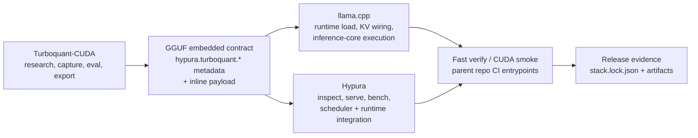

# Triality Platform

## TL;DR

Triality Platform is an integrated stack for turning Triality/TurboQuant
research into a shippable GGUF runtime.

It combines:

- `Turboquant-CUDA` for research, evaluation, packaging, and fixture generation
- `llama.cpp` for the inference-core runtime and embedded GGUF execution
- `Hypura` for inspection, serving, scheduling, and operational integration

The point of this repo is not just to pin three submodules. It is to keep one
shared contract, one verification story, and one release surface across all
three.

## Why This Repo Exists

Most quantization work stops at "the exporter runs" or "the model loads on one
machine." Triality Platform is the layer that keeps the whole path intact:

- research and profiling in CUDA-native code
- GGUF packaging with embedded `hypura.turboquant.*` metadata
- runtime interpretation in `llama.cpp`
- serving and inspection in `Hypura`
- stack-level fast verify and CUDA smoke from a single parent repo

If you want a repo that answers "what can this quantization method actually do
in production?" rather than just "can I generate an artifact?", this is the
stack.

## Integrated Stack

| Repo | Current upstream pin | Role in the stack | What the current upstream brings |
| --- | --- | --- | --- |
| `Turboquant-CUDA` | `main@8b8465b` | Research, eval, export, fixtures | Triality packaging, evaluation lanes, and studio-facing tooling |
| `llama.cpp` | `master@0357e9b` | Inference core | Embedded GGUF runtime, broad backend coverage, and the execution path Hypura builds on |
| `Hypura` | `main@95bc001` | Operational runtime | Inspect, serve, bench, scheduler/runtime updates, and compatibility surfaces |

The parent repo keeps these pins synchronized in `stack/stack.lock.json` and
exposes the stack-level verification entrypoints.

## End-To-End Flow



## What You Can Do With It

- Capture and evaluate Triality/TurboQuant variants in `Turboquant-CUDA`
- Package those variants into a GGUF contract that does not require a runtime
  sidecar
- Run the same embedded contract in `llama.cpp` and `Hypura`
- Audit runtime behavior from one parent repo instead of juggling three
  disconnected integrations
- Keep upstream pinning, validation, and release evidence under version control

## Repository Layout

- `repos/Turboquant-CUDA`: training, capture, evaluation, export, fixtures
- `repos/llama.cpp`: inference core, GGUF runtime, backend execution
- `repos/hypura`: operations runtime, inspect/serve/bench, scheduler
- `stack/`: lock file, schema, and stack contract metadata
- `docs/`: integration and release-facing documentation
- `ci/`: stack-level verification entrypoints

## Verification Paths

Fast verify on Windows:

```powershell
pwsh -File .\ci\verify-stack.ps1
```

Fast verify on POSIX:

```bash
./ci/verify-stack.sh
```

CUDA verify on Windows:

```powershell
pwsh -File .\ci\verify-stack-cuda.ps1
```

The fast verify lane checks pin consistency, fixture export, manifest
validation, and basic `Hypura` CPU smoke. The CUDA lane uses the Python
research environment from `repos/Turboquant-CUDA` through `uv` with the
canonical PyTorch `cu128` lane, then builds `llama.cpp` and `Hypura` against
CUDA for short runtime smoke on a practical local machine class. The fast
verify lane also exercises the canonical public mode
`triality-proxy-so8-pareto` plus its weight-plan summary on both targeted
model families. For SuperGemma4-E4B, the CUDA lane now verifies a formal paired
`text GGUF + mmproj GGUF` artifact contract, with Ollama-compatible image
requests and OpenAI-compatible image+audio requests.

## Local Patched Runtime

If you want to run the patched Gemma 4 server produced during this integration
work on this PC, use:

```cmd
run-gemma4-patched-llama-server.cmd
```

That launcher points at the validated local runtime build under
`F:\triality-targets\llama-gemma-mtmd\bin\Release\llama-server.exe` and starts
the paired Gemma 4 text GGUF + mmproj GGUF server on `127.0.0.1:8094` with
`--no-warmup`. Additional notes live in
`_docs/2026-04-19_use-patched-llama-cpp-on-this-pc_Codex.md`.

## CUDA Snapshot

Latest full Windows CUDA evidence:
`artifacts/cuda-smoke/20260417-011313`

This is a smoke snapshot, not a leaderboard benchmark. It exists to prove that
the embedded contract survives export, runtime load, and short generation on a
real local deployment class such as Windows 11 + RTX 3060.

Current upstream normalizes the pareto public mode to
`triality-proxy-so8-pareto` while retaining `triality-so8-pareto` as a legacy
alias for older artifacts and logs.

| Check | Evidence | Snapshot |
| --- | --- | --- |
| `llama-completion` runtime | `TurboQuant enabled via gguf` | embedded mode `triality-proxy-so8-pareto` (legacy alias `triality-so8-pareto`), seed `70367`, minimal offload `-ngl 1`, `1/33` layers on GPU |
| `llama-completion` throughput | `common_perf_print` | prompt eval `8.25 tok/s`, generation `3.76 tok/s` on `RTX 3060 12 GB` |
| `Hypura inspect` | `Source: gguf-embedded` | public mode `triality-proxy-so8-pareto` (legacy alias `triality-so8-pareto`), runtime mode `research-kv-split`, rotation `triality_vector`, payload `format=none bytes=0` |
| `Hypura run` | `TurboQuant blocking session complete` | `33/33` layers offloaded to GPU, generated `4` tokens, same GGUF contract and metadata source |

## Public Contract

The production contract is GGUF-embedded Triality/TurboQuant metadata and
payload.

- Public metadata stays under `hypura.turboquant.*`
- Runtime consumers are expected to work from GGUF plus embedded payload alone
- Sidecars may exist for research and reproducibility, but they are not the
  runtime source of truth
- The parent repo lock file updates the pinned upstream state without changing
  the meaning of the public GGUF contract

## Current Parent Lock

- `repos/Turboquant-CUDA`: `main@8b8465bd6c358fca79e61eb5aa73540021d2fcfc`
- `repos/llama.cpp`: `master@0357e9be3066c6b27dcc82e6404d7fd4a190d924`
- `repos/hypura`: `main@95bc0010c0e51a426c8aaae2ab77c4db1a94fbe6`

This repository is the source of truth for how those three upstreams are wired
together today.
