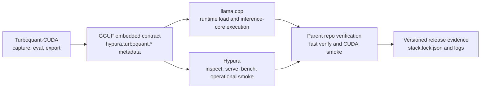

# Triality Platform

**Turn Triality and TurboQuant research into a reproducible GGUF runtime.**

Triality Platform is a Windows-first integration stack for people who want more
than "the exporter ran" or "the model loaded once." It keeps research, GGUF
packaging, runtime loading, and operational verification tied to one contract
and one release story.

It brings together:

- `Turboquant-CUDA` for capture, evaluation, export, and fixture generation
- `llama.cpp` for embedded GGUF contract loading and inference-core execution
- `Hypura` for inspection, serving, dry-run validation, and operational smoke
- a parent repo that verifies the stack as a single system

## Why It Matters

- One embedded contract across three repos
- GGUF metadata is the production source of truth
- Fast verification from the parent repo
- A practical target machine class: Windows 11 plus RTX 3060
- Clear separation between shipped behavior and ongoing research

## What Works Today

- Fixture export from `Turboquant-CUDA`
- GGUF-embedded `hypura.turboquant.*` metadata
- Runtime metadata checks in `llama.cpp`
- `Hypura inspect`, `serve --dry-run`, and `bench --dry-run`
- Windows fast verify and CUDA smoke entrypoints
- Versioned upstream pins in `stack/stack.lock.json`

## Quick Start

Clone the repo and initialize submodules:

```bash
git clone --recursive https://github.com/zapabob/triality-platform.git
cd triality-platform
```

Run the fast verification lane:

```powershell
pwsh -File .\ci\verify-stack.ps1
```

```bash
./ci/verify-stack.sh
```

Run the Windows CUDA smoke lane against a local GGUF:

```powershell
pwsh -File .\ci\verify-stack-cuda.ps1 -ModelPath C:\path\to\model.gguf
```

The fast lane is the self-contained verification story. The current CUDA lane
is a real-machine smoke path and still expects a local model path.

## End-To-End Flow



## Verification Story

The parent repo exists to answer one question:

> Does the same embedded contract survive export, validation, runtime load, and
> operational smoke?

The fast Windows lane currently checks:

1. submodule revision alignment
2. pinned revisions in `stack/stack.lock.json`
3. `Turboquant-CUDA` environment bootstrap
4. fixture export for `paper-faithful` and `triality-proxy-so8-pareto`
5. exported manifest validation
6. `Hypura inspect`
7. `Hypura serve --dry-run`
8. `Hypura bench --dry-run`

The Windows CUDA lane currently:

- bootstraps the `Turboquant-CUDA` `uv` environment with `cu128`
- builds `llama.cpp` and `Hypura` against CUDA
- validates embedded Triality metadata on a selected GGUF
- runs `Hypura` inspect and runtime smoke on real hardware

## Integrated Stack

| Repo | Current upstream pin | Role in the stack | Current focus |
| --- | --- | --- | --- |
| `Turboquant-CUDA` | `main@6b13443` | Research, eval, export, fixtures | Triality packaging, evaluation lanes, and fixture generation |
| `llama.cpp` | `master@0c0d6ae` | Inference core | Embedded GGUF runtime loading and backend execution |
| `Hypura` | `main@e3fb2fa` | Operational runtime | Inspect, serve, bench, and scheduler-facing runtime integration |

The parent repo keeps these pins synchronized in `stack/stack.lock.json` and
uses them as the reference release surface.

## Public Contract

The production contract is GGUF-embedded Triality and TurboQuant metadata.

- Public metadata stays under `hypura.turboquant.*`
- Embedded metadata is preferred over runtime environment overrides
- Sidecars can exist for research and reproducibility, but they are not the
  runtime source of truth
- `triality-proxy-so8-pareto` is the current public pareto label

## Reality Check

- This repo is about contract integrity and stack execution, not benchmark
  marketing
- The current CUDA lane is a smoke verification path, not a performance
  leaderboard
- Do not treat the existing verification lanes as proof that every future
  native weight TurboQuant kernel is already complete end to end

## Repository Layout

- `repos/Turboquant-CUDA`: research, capture, evaluation, export, fixtures
- `repos/llama.cpp`: inference core, GGUF runtime, backend execution
- `repos/hypura`: operations runtime, inspect, serve, bench, scheduler
- `stack/`: lock file and stack contract metadata
- `docs/`: integration and release-facing documentation
- `ci/`: stack-level verification entrypoints
- `_docs/`: implementation logs and machine-local engineering notes

## Current Parent Lock

- `repos/Turboquant-CUDA`: `main@6b13443fb4bae6d5a279ea683dfe5b1de33b414d`
- `repos/llama.cpp`: `master@0c0d6ae69329ff5000ac0896ea193cbd45940c7a`
- `repos/hypura`: `main@e3fb2fa1f533e47d15d895333a8378b2314524eb`

This repository is the source of truth for how those three upstreams are wired
together right now.
